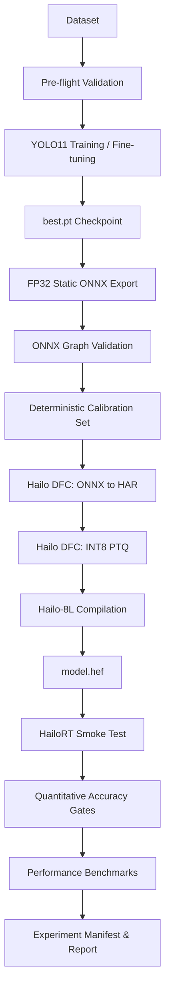

# Architecture Specification

## 1. System Overview

`hailo-yolo11-compiler` is a reproducible, state-machine driven Edge AI MLOps compiler and evaluation pipeline designed for deploying Ultralytics YOLO11 object detection models to the **Hailo-8L AI HAT+ on Raspberry Pi 5**.



## 2. Supported Execution Boundaries

The pipeline strictly enforces three distinct execution tiers to preserve research integrity and prevent fabricated metrics or hidden fallbacks:

```text
┌───────────────────────────────────────────────────────────────┐
│                    PORTABLE ML BOUNDARY                       │
│  (Host Workstation, Server, or Raspberry Pi 5 without Hailo)  │
│                                                               │
│  - Environment Doctor                                         │
│  - Dataset Pre-flight Validation                              │
│  - YOLO11 Training & Checkpoint Validation                    │
│  - FP32 ONNX Export (1x3x640x640 static)                      │
│  - ONNX Graph Validation & Smoke Inference                    │
│  - Deterministic Calibration Dataset Generation               │
│  - Baseline PyTorch / ONNX Validation                         │
└──────────────────────────────┬────────────────────────────────┘
                               │
                               ▼
┌───────────────────────────────────────────────────────────────┐
│                   HAILO COMPILATION BOUNDARY                  │
│       (Linux x86_64 host with Hailo Dataflow Compiler)        │
│                                                               │
│  - ONNX → Hailo Archive (HAR) Translation                     │
│  - Model Script (.alls) Normalisation Configuration           │
│  - INT8 Post-Training Quantisation (PTQ)                      │
│  - Hailo-8L Compilation & Scheduling                          │
│  - HEF Binary Validation                                      │
└──────────────────────────────┬────────────────────────────────┘
                               │
                               ▼
┌───────────────────────────────────────────────────────────────┐
│                     HAILO RUNTIME BOUNDARY                    │
│        (Raspberry Pi 5 + Hailo-8L AI HAT+ with HailoRT)       │
│                                                               │
│  - Physical Accelerator Discovery (/dev/hailo0)               │
│  - HEF Loading & Stream Configuration                         │
│  - Physical Device Smoke Inference                            │
│  - Hardware Latency (p50, p95, p99) & Throughput (FPS)        │
│  - Hardware Telemetry (SoC Temp, Throttling, Power)           │
└───────────────────────────────────────────────────────────────┘
```

## 3. Pipeline State Machine

The orchestration core implements an explicit, deterministic state machine (`yolo_hailo_mlops.state.StateMachine`). Each phase transitions through well-defined states:

- **PENDING**: Phase is registered but has not yet started.
- **RUNNING**: Phase is currently executing.
- **SUCCESS**: Phase concluded successfully; produced artefacts are cryptographically hashed.
- **FAILED**: Phase failed; diagnostic error codes, cause, and remediation are captured.
- **SKIPPED**: Phase bypassed via configuration or CLI flags (e.g., using existing valid artefacts).
- **NOT_EXECUTED**: Phase could not execute due to missing hardware or compiler environment boundaries.
- **CANCELLED**: Gracefully interrupted by `SIGINT` or `SIGTERM`.

Pipeline statuses distinguish between:
1. `SUCCESS`: All planned phases executed successfully.
2. `PARTIAL`: Portable stages passed, but Hailo compilation or runtime validation could not execute due to host boundary constraints.
3. `FAILED`: Any phase raised an unrecoverable error.
4. `NOT_EXECUTED`: No phases were run.
5. `CANCELLED`: Interrupted by user.

## 4. Separation of Concerns & Package Structure

```text
src/yolo_hailo_mlops/
├── cli.py             # CLI parser and command orchestration
├── config.py          # Strongly typed dataclasses & precedence resolver
├── logging.py         # Structured Console, Plaintext, and JSONL logging
├── exceptions.py      # Domain exception taxonomy with remediation guides
├── state.py           # Pipeline state machine and execution boundaries
├── manifest.py        # Experiment manifest serialisation
├── provenance.py      # Host platform and telemetry provenance
├── checksums.py       # SHA-256 recording and tamper detection
│
├── dataset/           # Dataset validation, statistics, and sampling
├── training/          # Ultralytics PyTorch training and checkpoint inspection
├── export/            # Static FP32 ONNX export and graph validation
├── calibration/       # Letterbox preprocessing and deterministic calibration packages
├── hailo/             # Hailo DFC parser, optimiser, compiler, and HailoRT runtime
├── evaluation/        # Quantitative evaluation, metrics, and accuracy degradation gates
├── performance/       # Latency percentiles, throughput, and system resource telemetry
└── utils/             # Atomic file writes, subprocess safety, and hashing
```

## 5. User Guides & Operational Manuals

For practical operational workflows, refer to the dedicated user documentation:
- [Complete User Guide & CLI Reference](user_guide.md)
- [Dataset Preparation, Formatting & Validation Manual](dataset_guide.md)
- [Configuration System & Parameter Reference Manual](configuration_guide.md)
- [Raspberry Pi 5 & Hailo-8L Deployment Guide](hardware_setup_guide.md)
- [Accuracy Gates & Performance Benchmarking Manual](benchmarking_and_evaluation.md)
- [Pipeline Execution Lifecycle](pipeline.md)
- [Hailo-8L Compilation & Hardware Deployment](hailo.md)
- [Calibration & Quantisation Contract](calibration.md)
- [Experiment Reproducibility & Result Integrity](reproducibility.md)
- [Troubleshooting & Error Codes Reference](troubleshooting.md)
